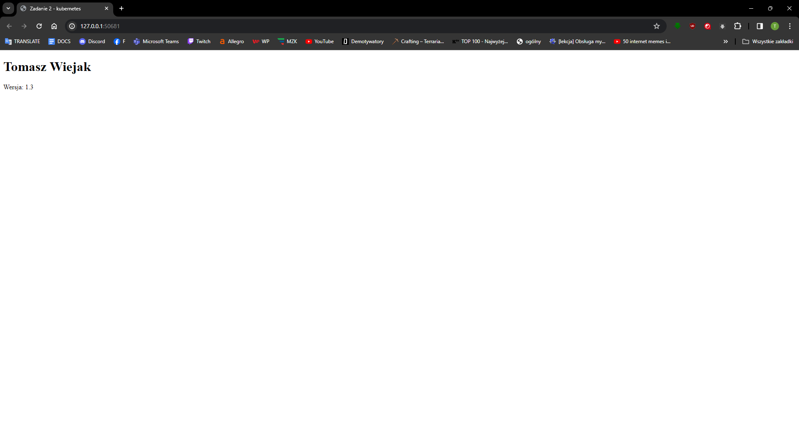
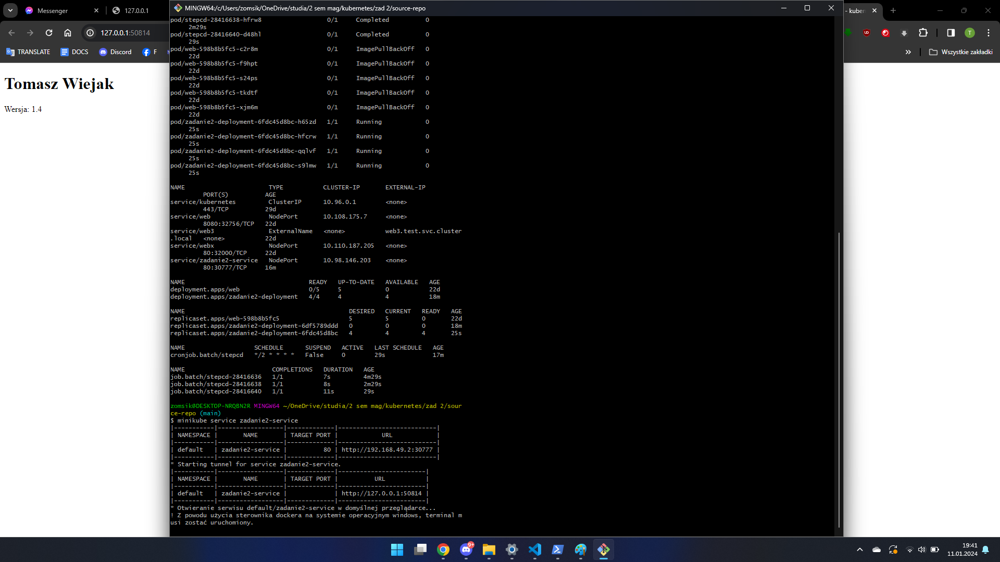
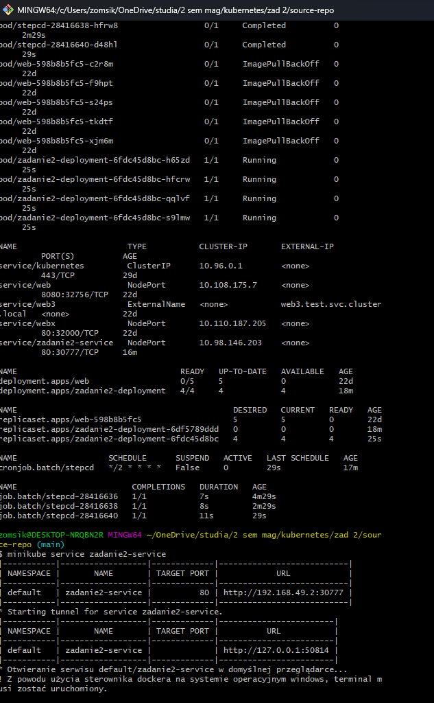

### Repozytoria na githubie:

https://github.com/zomsik/source-repo \
https://github.com/zomsik/config-repo

### Docker hub:

https://hub.docker.com/repositories/zomsik

W ramach zadania zostały wykonane wszystkie polecenie ze skryptu. Utworzony obraz zad2gitops został z pliku Dockerfile znajdującego się w folderze stepcd. CronJob natomiast z pliku stepcd/cron.yaml.

w .github/workflows/zad2lab10.yml umieściłem kod odpowiedzialny za github actions. Wszelki potrzebny kod brałem z oficjalnych repozytoriów danych akcji: \
https://github.com/actions/checkout \
https://github.com/docker/setup-qemu-action \
https://github.com/docker/setup-buildx-action \
https://github.com/docker/login-action \
https://github.com/docker/build-push-action


Na początku pliku zautomatyzowałem uruchamianie całego workflow poprzez włączanie na każdy push na branchu main do repozytorium:
```
on:
  push:
    branches:
      - main
``` 

Dodatkowo w kubernetesCI dodałem warunek logiczny:
```
if git diff --quiet; then
          echo "deployment.yaml nie wymaga commitowania."
        else
          git add deployment.yaml
          git commit -m "Aktualizacja wersji w deployment.yaml do wersji ${{ needs.dockerCI.outputs.wersja }} "
          git push origin main
        fi
```
który sprawdza czy zostały dokonane jakiekolwiek zmiany do commitowania, brak tego warunku powodował niepowodzenie budowy kubernetesCI w przypadku, gdy nie podbito wersji w pliku index.html (problem: nothing to commit)

### Kroki 3 i 4:

Poniżej widać automateczny update strony po wykonaniu CronJoba. Pierwsze zdjęcie jest przed commitem i pushem, a drugie po zmianie wersji na 1.4 i pushu na repozytorium github.






Poniżej przedstawiono również przybliżenie urywku konsoli po wykonaniu wszystkich zadań. Pracowałem na systemie windows i tutaj nie mogłem wejść przez adres http://zad2.lab, a przez wykonanie polecenie
```
minikube service zadanie2-service
```
, które otwierało w przeglądarce wyżej pokazaną stronę. Aktualizacja strony następuje po ponownym wykonaniu powyższej komendy, która ponownie uruchamia przeglądarkę na innym dostępnym porcie.

